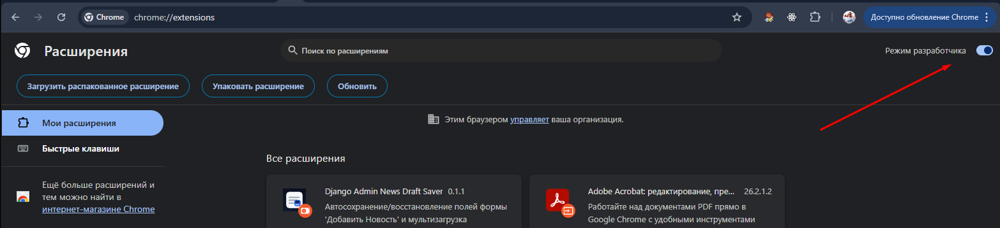
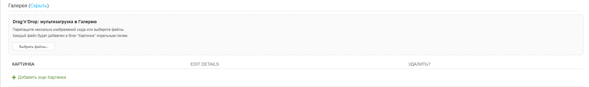
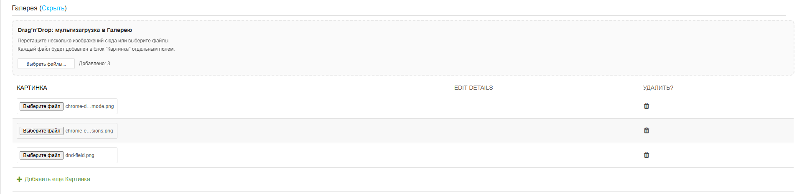

# 📰 Django Admin News Draft Saver (Chrome/Chromium Extension)

Расширение для страниц Django Admin «Добавить Новость»:

- сохраняет значения полей формы перед отправкой (включая файлы);
- при ошибках отправки (валидация/прочее) восстанавливает значения из localStorage/IndexedDB;
- добавляет в раздел «Галерея» Drag’n’Drop поле мультизагрузки изображений и автоматически раскладывает файлы по новым строкам inline-таблицы.

## 🧩 Установка (Chrome / Chromium / Edge)

1. Откройте `chrome://extensions`.

2. Включите **Режим разработчика** (тумблер в правом верхнем углу)

3. Нажмите **Загрузить распакованное расширение** (Load Unpacked) и выберите папку проекта (где лежит `manifest.json`).

## ⚙️ Как это работает

- **Текстовые поля** хранятся в `localStorage` (ключ вида `newsDraft:<pathname>`).
- **Файлы** (главная картинка и картинки галереи) хранятся в **IndexedDB** (чтобы не упираться в лимиты localStorage).
- При возврате на страницу с ошибками Django Admin (наличие `.errornote` / `.errorlist` и т.п.) расширение восстанавливает поля и снова выставляет файлы в `<input type="file" />`.

## 💾 Что сохраняется

- Название (`#id_title`)
- Слаг (`#id_slug`)
- Аннотация (`#id_annotation`)
- Текст (CKEditor / `#id_text`)
- Изображение (`#id_image`)
- Дата/время начала (`#id_date_from_0`, `#id_date_from_1`)
- Дата/время окончания (`#id_date_to_0`, `#id_date_to_1`)
- Все выбранные изображения в «Галерея» (`News_gallery-*-image_f`)

## 🖼️ Drag’n’Drop в «Галерею»

Зона появляется внутри блока «Галерея». При дропе/выборе нескольких файлов расширение:

1. Добавляет нужное количество строк в inline-таблицу "Галерея";
2. Добавляет каждый файл в соответствующий `<input type="file" />`.

[//]: Доакументация:
[//]: https://gist.github.com/Jekins/2bf2d0638163f1294637
[//]: Эмодзи-лист:
[//]: https://gist.github.com/rxaviers/7360908

